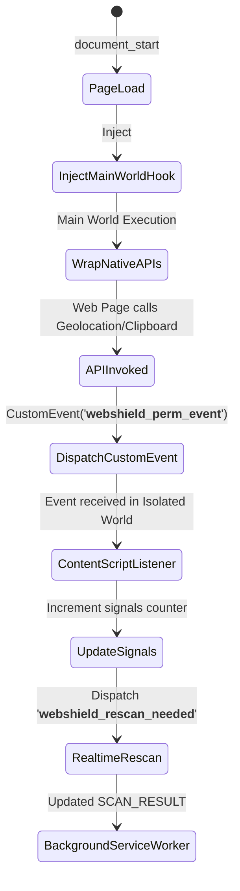
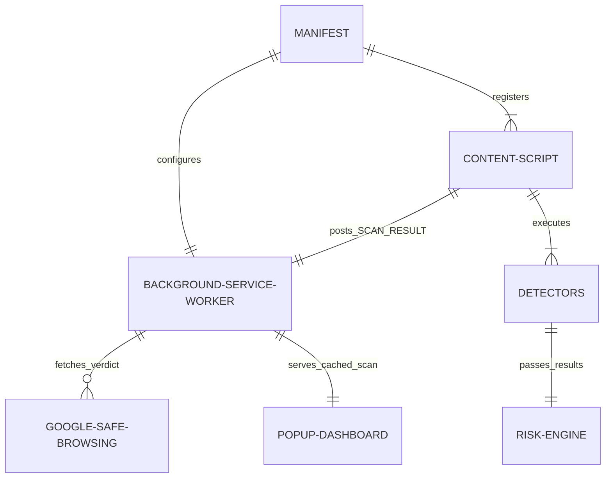
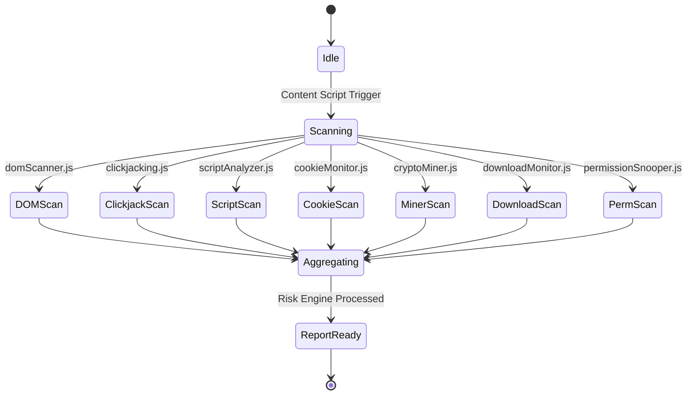

# WebShield AI — Official Technical Documentation & Architecture Manual

> **Version**: 1.0.0  
> **Target Platform**: Google Chrome (Manifest V3)  
> **Document Status**: Official Internal Architecture & Developer Guide  
> **Authors**: Senior Software Architect & Cybersecurity Engineering Team  

---

## Executive Summary

**WebShield AI** is an advanced, lightweight browser security assistant engineered for Google Chrome (Manifest V3). It provides real-time client-side threat detection and web safety verification without sending private user data or page content to external servers (with the exception of optional, privacy-preserving Google Safe Browsing hash lookups).

This documentation provides an end-to-end technical reference for developers, security researchers, and software engineers. It details the complete system architecture, Chrome Extension Manifest V3 implementation, file-by-file responsibilities, cross-world execution models, individual detection heuristics, risk engine algorithms, and operational workflows.

---

## Table of Contents

1. [Project Overview](#1-project-overview)
2. [Folder Structure](#2-folder-structure)
3. [File-by-File Documentation](#3-file-by-file-documentation)
4. [Manifest.json Deep Explanation](#4-manifestjson-deep-explanation)
5. [Background Service Worker](#5-background-service-worker)
6. [Content Script Lifecycle](#6-content-script-lifecycle)
7. [Detector Architecture](#7-detector-architecture)
   - 7.1 [DOM XSS Detector (`domScanner.js`)](#71-dom-xss-detector-domscannerjs)
   - 7.2 [Clickjacking Detector (`clickjacking.js`)](#72-clickjacking-detector-clickjackingjs)
   - 7.3 [Malicious JavaScript Detector (`scriptAnalyzer.js`)](#73-malicious-javascript-detector-scriptanalyzerjs)
   - 7.4 [Cookie Theft Detector (`cookieMonitor.js`)](#74-cookie-theft-detector-cookiemonitorjs)
   - 7.5 [Crypto Miner Detector (`cryptoMiner.js`)](#75-crypto-miner-detector-cryptominerjs)
   - 7.6 [Drive-by Download Detector (`downloadMonitor.js`)](#76-drive-by-download-detector-downloadmonitorjs)
   - 7.7 [Permission Snooping Detector (`permissionSnooper.js`)](#77-permission-snooping-detector-permissionsnooperjs)
   - 7.8 [Google Safe Browsing Integration](#78-google-safe-browsing-integration)
8. [Risk Engine](#8-risk-engine)
9. [Popup Dashboard](#9-popup-dashboard)
10. [Google Safe Browsing Integration Details](#10-google-safe-browsing-integration-details)
11. [System Event Diagrams](#11-system-event-diagrams)
12. [Security Design Decisions](#12-security-design-decisions)
13. [Performance & Optimization](#13-performance--optimization)
14. [Limitations & Edge Cases](#14-limitations--edge-cases)
15. [Future Scope & Roadmap](#15-future-scope--roadmap)
16. [Installation Guide](#16-installation-guide)
17. [Testing Guide & Fixture Page](#17-testing-guide--fixture-page)
18. [Frequently Asked Questions (FAQ)](#18-frequently-asked-questions-faq)
19. [Glossary of Terms](#19-glossary-of-terms)
20. [Conclusion](#20-conclusion)

---

## 1. Project Overview

### 1.1 What is WebShield AI?
WebShield AI is a Chrome Browser Extension designed to protect users against zero-day browser threats, client-side web vulnerabilities, predatory browser permission abuses, and malicious script executions. It acts as an active shield operating directly inside the browser rendering pipeline, continually analyzing DOM mutations, JavaScript executions, API probing, and network telemetry.

### 1.2 Problem Statement
Modern web applications execute complex, untrusted JavaScript directly inside user browsers. Traditional perimeter security (DNS filters, firewalls, static blocklists) fail to detect real-time client-side attacks, including:
- **DOM-based Cross-Site Scripting (XSS)** executed entirely in the client DOM.
- **Silent Permission Snooping**, where previously approved permissions (camera, microphone, geolocation, clipboard) are read without re-prompting the user.
- **Drive-by Executable Downloads** disguised via Blob URLs or hidden DOM elements.
- **Cryptojacking**, where background web workers hijack CPU cycles to mine cryptocurrency.
- **Session Hijacking & Cookie Theft**, where scripts read `document.cookie` and exfiltrate credentials to third-party endpoints.

### 1.3 Objectives
- **Zero Privacy Overhead**: Conduct all behavioral heuristics locally inside the browser.
- **Zero Latency Penalty**: Perform asynchronous, non-blocking DOM and script inspections without slowing page rendering.
- **Actionable Intelligence**: Replace cryptic technical logs with clear, color-coded threat statuses (`Safe`, `Suspicious`, `Danger`, `Critical`) and human-readable recommendations.
- **Dual-Layer Verification**: Combine fast local behavioral heuristics with ground-truth reputation checks via Google Safe Browsing.

---

## 2. Folder Structure

The project directory is structured into isolated, single-responsibility modules:

```text
webshield-ai/
├── README.md                 # Brief project summary and quickstart
├── DOCUMENTATION.md          # Comprehensive technical documentation (this file)
├── manifest.json             # Chrome Extension Manifest V3 configuration
├── background.js             # Service Worker (Background event orchestrator & Safe Browsing client)
├── content.js                # Content Script coordinator (Isolated World coordinator)
├── assets/                   # Extension icons and visual branding assets
│   └── icons/
│       ├── icon16.png        # 16x16 Favicon/Toolbar icon
│       ├── icon48.png        # 48x48 Extension Management icon
│       └── icon128.png       # 128x128 Web Store icon
├── popup/                    # Main User Interface (Extension Action Popup)
│   ├── popup.html            # HTML structure for the dashboard UI
│   ├── popup.css             # Glassmorphism dark-theme design system
│   └── popup.js              # UI controller, state renderer, and message handler
├── options/                  # User Options & Configuration Page
│   ├── options.html          # HTML settings page for Safe Browsing API key setup
│   ├── options.css           # Options page styling
│   └── options.js            # Controller managing chrome.storage.local API keys
└── utils/                    # Shared core utilities & detection engines
    ├── riskEngine.js         # Classification and recommendation engine
    └── detectors/            # Specialized security detection modules
        ├── domScanner.js     # DOM XSS vector detector
        ├── clickjacking.js   # Clickjacking & overlay trap detector
        ├── scriptAnalyzer.js # Obfuscated & malicious JS code analyzer
        ├── cookieMonitor.js   # Cookie theft & exfiltration detector
        ├── cryptoMiner.js    # Cryptojacking & CPU loop detector
        ├── downloadMonitor.js# Drive-by download & Blob URL monitor
        └── permissionSnooper.js# Sensitive API & sensor snooping detector
```

### Folder Responsibilities Table

| Folder | Primary Responsibility |
| :--- | :--- |
| `assets/` | Stores extension icons required by Chrome for toolbar, menu, and store displays. |
| `popup/` | Renders the extension dashboard interface when the user clicks the extension icon. |
| `options/` | Provides the configuration UI for managing user settings (e.g., Safe Browsing API key). |
| `utils/` | Contains core logic engines decoupled from UI components. |
| `utils/detectors/` | Houses isolated detection modules that implement specific security heuristics. |

---

## 3. File-by-File Documentation

### 3.1 `manifest.json`
- **Purpose**: Defines metadata, permissions, entry points, script execution rules, and security policies for Chrome Extensions Manifest V3.
- **Dependencies**: Referenced directly by the Chrome Extension engine upon loading.
- **Execution Order**: Evaluated first when Chrome loads or updates the extension.

### 3.2 `background.js`
- **Purpose**: Acts as the centralized Service Worker running in a background event-driven thread.
- **Responsibilities**:
  - Maintains per-tab scan cache (`scanCache`).
  - Communicates with Google Safe Browsing v4 API.
  - Caches Safe Browsing responses (`sbCache` with 10-minute TTL).
  - Handles trusted domains whitelist in `chrome.storage.local`.
  - Serves scan data to `popup.js` when queried.
- **Key Functions**: `checkSafeBrowsing()`, `processScanResult()`, `getStoredApiKey()`, `getTrustedSites()`, `setTrustedSites()`.

### 3.3 `content.js`
- **Purpose**: Content Script executed inside the context of every loaded web page at `document_start`.
- **Responsibilities**:
  - Coordinates all 7 detection modules in isolation.
  - Aggregates individual reports safely using error boundaries (`runOne()`).
  - Listens for real-time rescan requests (`__webshield_rescan_needed__`).
  - Sends full diagnostic payloads (`SCAN_RESULT`) to `background.js`.
- **Key Functions**: `runAllDetectors()`, `runOne()`, `triggerRealtimeRescan()`.

### 3.4 `utils/riskEngine.js`
- **Purpose**: Risk classification and recommendation generator.
- **Responsibilities**:
  - Maps numerical risk scores to threat bands (`Safe`, `Low`, `Medium`, `High`, `Critical`).
  - Evaluates threat vectors to generate actionable user recommendations.
- **Key Functions**: `classify(score)`, `recommend(threats)`.

### 3.5 `utils/detectors/domScanner.js`
- **Purpose**: Detects DOM-based Cross-Site Scripting (XSS).
- **Responsibilities**:
  - Scans DOM elements and inline scripts for dangerous sink operations (`eval`, `innerHTML`, `document.write`, `setTimeout` strings).
  - Inspects event handlers (`onload`, `onerror`, `onclick`).

### 3.6 `utils/detectors/clickjacking.js`
- **Purpose**: Detects UI redressing and clickjacking overlays.
- **Responsibilities**:
  - Inspects `<iframe>` elements for zero opacity, hidden visibility, or fullscreen fixed positions.
  - Detects high `z-index` transparent overlay elements and hidden interactive elements (`<button>`, `<a role="button">`).

### 3.7 `utils/detectors/scriptAnalyzer.js`
- **Purpose**: Analyzes JavaScript code for obfuscation and malicious patterns.
- **Responsibilities**:
  - Fetches external scripts asynchronously and scans inline scripts.
  - Evaluates patterns like Base64 decoding (`atob`), character code chains (`String.fromCharCode`), packed scripts, and high-entropy variable names.

### 3.8 `utils/detectors/cookieMonitor.js`
- **Purpose**: Detects session hijacking and cookie theft.
- **Responsibilities**:
  - Traps `document.cookie` read operations.
  - Tracks outbound network requests (`fetch`, `XMLHttpRequest`, `sendBeacon`).
  - Correlates cookie reads with cross-origin transmissions within a 3-second correlation window.

### 3.9 `utils/detectors/cryptoMiner.js`
- **Purpose**: Detects cryptojacking and unauthorized CPU mining.
- **Responsibilities**:
  - Monitors Web Worker creations and inspects worker code blobs for mining signatures (`CoinHive`, `Cryptonight`, `hashesPerSecond`).
  - Detects intensive CPU hashing loops.

### 3.10 `utils/detectors/downloadMonitor.js`
- **Purpose**: Detects drive-by downloads and hidden file downloads.
- **Responsibilities**:
  - Scans for hidden `<a>` elements with `download` attributes pointing to executable extensions (`.exe`, `.bat`, `.vbs`, `.zip`).
  - Tracks `URL.createObjectURL(blob)` calls.

### 3.11 `utils/detectors/permissionSnooper.js`
- **Purpose**: Detects sensitive browser APIs and sensors probing.
- **Responsibilities**:
  - Injects a Main-World interceptor script at `document_start` to wrap native methods (`navigator.geolocation`, `navigator.clipboard`, `navigator.mediaDevices.getUserMedia`, `Notification.requestPermission`, `navigator.permissions.query`).
  - Dispatches `CustomEvent` signals to content script.
  - Performs static script analysis for permission probing code.

### 3.12 `popup/popup.html`, `popup.css`, `popup.js`
- **Purpose**: Extension action interface.
- **Responsibilities**:
  - Displays overall page safety status banner (`All Clear`, `Caution`, `Warning`, `Critical`).
  - Displays 8 threat cards and live sensor access chips (`Location`, `Clipboard`, `Camera`, `Microphone`).
  - Manages trust toggle state and manual scan refreshes.

### 3.13 `options/options.html`, `options.css`, `options.js`
- **Purpose**: Extension configuration interface.
- **Responsibilities**:
  - Allows users to securely save or clear their Google Safe Browsing API Key into `chrome.storage.local`.

---

## 4. Manifest.json Deep Explanation

WebShield AI is built ground-up on **Manifest V3 (MV3)**, Google's modern extension standard. Below is the complete manifest explanation:

```json
{
  "manifest_version": 3,
  "name": "WebShield AI",
  "version": "1.0.0",
  "description": "Lightweight browser security assistant...",
  "permissions": [
    "activeTab",
    "scripting",
    "storage",
    "tabs"
  ],
  "host_permissions": [
    "<all_urls>"
  ],
  "background": {
    "service_worker": "background.js"
  },
  "content_scripts": [
    {
      "matches": ["<all_urls>"],
      "js": [
        "utils/detectors/domScanner.js",
        "utils/detectors/clickjacking.js",
        "utils/detectors/scriptAnalyzer.js",
        "utils/detectors/cookieMonitor.js",
        "utils/detectors/cryptoMiner.js",
        "utils/detectors/downloadMonitor.js",
        "utils/detectors/permissionSnooper.js",
        "utils/riskEngine.js",
        "content.js"
      ],
      "run_at": "document_start",
      "all_frames": false
    }
  ]
}
```

### Permission Matrix

| Permission | Technical Reason |
| :--- | :--- |
| `activeTab` | Grants temporary access to the active tab to execute inspect operations when popup opens. |
| `scripting` | Enables dynamic script execution capabilities required for fallback script inspections. |
| `storage` | Allows saving settings (Google Safe Browsing API Key, Trusted Sites list) across browser restarts. |
| `tabs` | Allows querying active tab URLs, status updates (`onUpdated`), and tab removals (`onRemoved`). |
| `<all_urls>` | Required so content scripts can monitor security across any website visited by the user. |

### Manifest V3 Architecture Highlights
- **Background Service Worker**: Replaces persistent MV2 background pages with an event-driven Service Worker (`background.js`) that terminates when idle, saving system RAM.
- **Document Start Injection (`run_at: "document_start"`)**: Ensures detectors run before webpage scripts execute, allowing main-world API monkey-patching before page code invokes sensitive methods.

---

## 5. Background Service Worker

`background.js` operates as the central hub for state caching, Safe Browsing API communication, and tab management.

### Key Workflows
1. **Per-Tab Caching**: Stores scan results in `scanCache[tabId]`. When the user switches tabs or reopens the popup, results load instantly without re-scanning.
2. **Safe Browsing Proxying**: Content scripts cannot directly execute Safe Browsing API lookups without risking API key exposure in DOM. `background.js` handles API requests securely.
3. **Tab Lifecycle Hooks**:
   - `chrome.tabs.onUpdated`: Clears cached scans when a tab navigates to a new URL and requests a fresh scan upon `status === "complete"`.
   - `chrome.tabs.onRemoved`: Purges cache entries to prevent memory leaks.

---

## 6. Content Script Lifecycle

`content.js` serves as the orchestrator inside the browser tab context:

```text
[Document Start] -> Inject Detector Scripts -> Inject Main-World Hooks
                                      │
                                      ▼
                             [Run All Detectors]
                                      │
                                      ▼
                        [Aggregate Scores & Findings]
                                      │
                                      ▼
                      [SendMessage to background.js]
```

### Fault-Tolerant Execution (`runOne`)
To guarantee that a runtime error or CSP block in one detector never crashes the entire security scan, `content.js` wraps every detector in an asynchronous error boundary (`runOne`):

```javascript
async function runOne(name, detector) {
  if (!detector || typeof detector.run !== "function") {
    return { score: 0, weight: 100, label: "Safe", findings: [] };
  }
  try {
    const result = await detector.run();
    return result;
  } catch (err) {
    return { score: 0, weight: 100, label: "Safe", findings ruin: [], error: String(err) };
  }
}
```

---

## 7. Detector Architecture

This section details each of the 7 client detectors plus Google Safe Browsing.

---

### 7.1 DOM XSS Detector (`domScanner.js`)

- **Purpose**: Detects Document Object Model Cross-Site Scripting (DOM XSS).
- **Threat**: Attackers inject untrusted data into dangerous DOM sinks (`eval`, `innerHTML`, `document.write`), causing code execution.
- **Detection Strategy**: Scans DOM nodes, attributes, and inline scripts for sink usage and inline event handlers (`onload`, `onerror`, `onclick`).

#### Pseudocode
```text
FUNCTION run():
    score = 0
    findings = []
    
    FOR EACH script IN document.scripts:
        IF script.text CONTAINS "eval(" OR "document.write(" OR "innerHTML":
            score += 35
            APPEND "Dangerous DOM sink detected" TO findings
            
    FOR EACH element IN document.all:
        IF element HAS attribute STARTING WITH "on" (e.g. onerror):
            IF attribute CONTAINS "eval" OR "atob":
                score += 40
                APPEND "Malicious inline event handler" TO findings
                
    RETURN { score: CLAMP(score, 0, 100), label: CLASSIFY(score), findings: findings }
END FUNCTION
```

#### Scoring & Bands
- `score >= 60`: **Danger**
- `score >= 25`: **Suspicious**
- `score < 25`: **Safe**

---

### 7.2 Clickjacking Detector (`clickjacking.js`)

- **Purpose**: Detects UI Redressing / Clickjacking overlay traps.
- **Threat**: Transparent elements or hidden `<iframe>` tags overlaying legitimate buttons to trick users into performing unintended actions.
- **Detection Strategy**: Inspects computed CSS properties (`opacity`, `z-index`, `pointer-events`, `visibility`) of `<iframe>` and fixed overlay elements.

#### Pseudocode
```text
FUNCTION run():
    score = 0
    findings = []
    
    FOR EACH iframe IN document.iframes:
        style = getComputedStyle(iframe)
        IF (style.opacity == 0 OR style.visibility == "hidden") AND NOT isTiny(iframe):
            score += 35
            APPEND "Invisible iframe detected" TO findings
        ELSE IF iframe covers >90% viewport AND style.zIndex > 100:
            score += 30
            APPEND "Fullscreen iframe overlay" TO findings
            
    FOR EACH element IN document.all:
        style = getComputedStyle(element)
        IF style.position IN ["fixed", "absolute"] AND coversViewport(element):
            IF style.pointerEvents == "none" AND style.zIndex > 500:
                score += 25
                APPEND "Overlay trap detected" TO findings
                
    hiddenButtons = COUNT(buttons WHERE style.display == "none" OR style.visibility == "hidden")
    score += MIN(15, hiddenButtons * 3)
    
    RETURN { score: CLAMP(score, 0, 100), label: CLASSIFY(score), findings: findings }
END FUNCTION
```

---

### 7.3 Malicious JavaScript Detector (`scriptAnalyzer.js`)

- **Purpose**: Detects obfuscated, packed, or malicious JavaScript code.
- **Threat**: Malware authors obfuscate payload code using Base64 (`atob`), string character encoding (`String.fromCharCode`), or high-entropy dynamic scripts to evade detection.
- **Detection Strategy**: Fetches external script sources asynchronously and scans inline scripts for obfuscation markers.

#### Pseudocode
```text
FUNCTION run():
    score = 0
    findings = []
    
    FOR EACH scriptContent IN (inlineScripts + fetchedExternalScripts):
        IF scriptContent CONTAINS "atob(" AND "eval(":
            score += 45
            APPEND "Obfuscated eval(atob()) chain detected" TO findings
        IF COUNT_OCCURRENCES(scriptContent, "String.fromCharCode") > 5:
            score += 30
            APPEND "String.fromCharCode character encoding chain" TO findings
        IF scriptContent CONTAINS "unescape(" AND "%3Cscript":
            score += 35
            APPEND "Unescaped script injection pattern" TO findings
            
    RETURN { score: CLAMP(score, 0, 100), label: CLASSIFY(score), findings: findings }
END FUNCTION
```

---

### 7.4 Cookie Theft Detector (`cookieMonitor.js`)

- **Purpose**: Detects session hijacking and cookie exfiltration.
- **Threat**: Malicious scripts read `document.cookie` and transmit session tokens to remote third-party attacker endpoints via `fetch`, `XMLHttpRequest`, or `sendBeacon`.
- **Detection Strategy**: Traps getter invocations on `Document.prototype.cookie` and monitors outbound cross-origin network requests executed within a 3000ms correlation window.

#### Pseudocode
```text
TRAP Document.prototype.cookie GETTER:
    signals.cookieReads++
    lastCookieReadAt = CURRENT_TIME()
    RETURN originalCookie()

FUNCTION flagIfExfil(requestUrl):
    IF isThirdPartyUrl(requestUrl) AND (CURRENT_TIME() - lastCookieReadAt) < 3000ms:
        signals.suspiciousOutbound++

FUNCTION run():
    score = 0
    IF signals.suspiciousOutbound > 0:
        score += MIN(70, signals.suspiciousOutbound * 35)
        APPEND "Outbound request to 3rd party host shortly after cookie read" TO findings
    IF signals.beacons > 0 AND signals.crossOriginRequests > 0:
        score += MIN(30, signals.beacons * 15)
        APPEND "sendBeacon() to cross-origin endpoint" TO findings
        
    RETURN { score: CLAMP(score, 0, 100), label: CLASSIFY(score), findings: findings }
END FUNCTION
```

---

### 7.5 Crypto Miner Detector (`cryptoMiner.js`)

- **Purpose**: Detects unauthorized cryptojacking and CPU mining.
- **Threat**: Websites run background Web Workers that execute compute-intensive hashing loops (Cryptonight, CoinHive) to mine cryptocurrency, degrading system performance and battery life.
- **Detection Strategy**: Monitors Web Worker initialization, scans blob URLs for mining code signatures (`CoinHive`, `hashesPerSecond`, `Cryptonight`), and measures CPU loop activity.

#### Pseudocode
```text
TRAP window.Worker CONSTRUCTOR(scriptUrl):
    IF scriptUrl IS BlobURL:
        blobText = READ_BLOB(scriptUrl)
        IF blobText CONTAINS "CoinHive" OR "Cryptonight" OR "hashesPerSecond":
            signals.minerWorkerDetected = TRUE
    RETURN originalWorker(scriptUrl)

FUNCTION run():
    score = 0
    IF signals.minerWorkerDetected:
        score += 85
        APPEND "Cryptominer Web Worker initialized" TO findings
    IF staticCodeCONTAINS("CoinHive.Anonymous"):
        score += 70
        APPEND "CoinHive miner signature in page scripts" TO findings
        
    RETURN { score: CLAMP(score, 0, 100), label: CLASSIFY(score), findings: findings }
END FUNCTION
```

---

### 7.6 Drive-by Download Detector (`downloadMonitor.js`)

- **Purpose**: Detects silent, hidden, or automatic file download attempts.
- **Threat**: Malicious websites automatically trigger download prompts for executable files (`.exe`, `.bat`, `.vbs`, `.iso`) without explicit user consent.
- **Detection Strategy**: Monitors DOM for hidden `<a>` elements with `download` attributes pointing to executable extensions, and intercepts `URL.createObjectURL(blob)` download clicks.

#### Pseudocode
```text
FUNCTION run():
    score = 0
    findings = []
    
    FOR EACH anchor IN document.querySelectorAll("a[download]"):
        filename = anchor.getAttribute("download")
        style = getComputedStyle(anchor)
        isExecutable = MATCHES_EXTENSION(filename, [".exe", ".bat", ".vbs", ".msi", ".iso", ".zip"])
        
        IF (style.display == "none" OR style.visibility == "hidden") AND isExecutable:
            score += 65
            APPEND "Hidden executable download link detected" TO findings
        ELSE IF isExecutable:
            score += 30
            APPEND "Executable download link present" TO findings
            
    RETURN { score: CLAMP(score, 0, 100), label: CLASSIFY(score), findings: findings }
END FUNCTION
```

---

### 7.7 Permission Snooping Detector (`permissionSnooper.js`)

- **Purpose**: Detects active or background probing of sensitive browser APIs (Geolocation, Camera, Microphone, Clipboard, Notifications, Device Enumeration).
- **Threat**: Once a user grants permission to a domain, the site can silently read location or record mic/camera data in the background without triggering a fresh prompt.
- **Detection Strategy**: Injects a **Main World** script hook at `document_start` to intercept API calls (`navigator.geolocation.getCurrentPosition`, `navigator.clipboard.readText`, `navigator.mediaDevices.getUserMedia`) and communicates back to content script via `CustomEvent`. Also performs static script parsing.

#### Architecture State Diagram


#### Pseudocode
```text
// MAIN WORLD HOOK SCRIPT
WRAP navigator.geolocation.getCurrentPosition(success, error, options):
    DISPATCH CustomEvent('__webshield_perm_event__', { type: 'geolocation', highAccuracy: options.enableHighAccuracy })
    RETURN originalGetCurrentPosition(...)

WRAP navigator.clipboard.readText():
    DISPATCH CustomEvent('__webshield_perm_event__', { type: 'clipboard' })
    RETURN originalReadText(...)

// CONTENT SCRIPT DETECTOR
ON CustomEvent('__webshield_perm_event__', detail):
    INCREMENT signals[detail.type]
    TRIGGER realtimeRescan()

FUNCTION run():
    staticProbes = scanStaticScriptsForPermissionKeywords()
    effectiveGeo = MAX(signals.geolocation, staticProbes.geolocation)
    effectiveClip = MAX(signals.clipboard, staticProbes.clipboard)
    
    score = (effectiveGeo * 35) + (effectiveClip * 12) + (effectiveMic * 40)
    RETURN { score: CLAMP(score, 0, 100), label: CLASSIFY(score), findings: findings, permissions: signals }
END FUNCTION
```

---

### 7.8 Google Safe Browsing Integration

- **Purpose**: Performs ground-truth URL reputation checks against Google's global threat database.
- **Threat**: Phishing domains, known malware distribution hosts, and social engineering sites.
- **Detection Strategy**: `background.js` posts page URLs to Google Safe Browsing API v4 endpoint (`threatMatches:find`).

---

## 8. Risk Engine

The Risk Engine (`utils/riskEngine.js`) translates per-detector outputs into human-readable recommendations and diagnostic matrices.

### 8.1 Classification Thresholds
Each detector score (0 to 100) is classified into a threat label:

$$\text{Label} = \begin{cases} \text{Safe} & \text{if } 0 \le \text{Score} \le 20 \\ \text{Suspicious} & \text{if } 21 \le \text{Score} \le 54 \\ \text{Danger} & \text{if } 55 \le \text{Score} \le 100 \end{cases}$$

### 8.2 Recommendation Synthesis Algorithm
The engine evaluates threat labels across all 8 detectors to compile actionable advice:

```javascript
function recommend(threats) {
  const tips = [];
  if (threats["DOM XSS"] === "Danger") tips.push("Close this page — it uses dangerous DOM sinks (eval, innerHTML).");
  if (threats["Clickjacking"] === "Danger") tips.push("Possible clickjacking overlay detected. Do not click links on this page.");
  if (threats["Malicious JS"] === "Danger") tips.push("Highly obfuscated JavaScript detected. Avoid interacting with this page.");
  if (threats["Cookie Theft"] === "Danger") tips.push("Cookies may be exfiltrated to an external endpoint. Leave immediately.");
  if (threats["Crypto Miner"] === "Danger") tips.push("Cryptomining activity detected. Close this tab to free your CPU.");
  if (threats["Drive-by Download"] === "Danger") tips.push("Automatic executable download detected. Do not run downloaded files.");
  if (threats["Permission Snooping"] === "Danger") tips.push("This page is silently accessing camera, mic, or location. Revoke permissions.");
  
  if (tips.length === 0) tips.push("This page appears safe.");
  return tips;
}
```

---

## 9. Popup Dashboard

The popup interface (`popup/`) provides a modern dark-theme glassmorphism dashboard.

```text
┌─────────────────────────────────────────────────────────┐
│ WebShield AI                example.com               ⚙ │
├─────────────────────────────────────────────────────────┤
│ [ 🛡️ WARNING ]           2 of 8 detectors flagged      │
├─────────────────────────────────────────────────────────┤
│ DETECTED BEHAVIORS                                      │
│ ┌───────────────┐ ┌───────────────┐ ┌─────────────────┐ │
│ │ DOM XSS       │ │ Clickjacking  │ │ Permission Snoop│ │
│ │    Danger     │ │     Safe      │ │   Suspicious    │ │
│ └───────────────┘ └───────────────┘ └─────────────────┘ │
│ SENSORS ACCESSED BY THIS PAGE                           │
│ [ Location (live): 1 ]   [ Clipboard: 1 ]               │
├─────────────────────────────────────────────────────────┤
│ RECOMMENDATIONS                                         │
│ • Close this page — it uses dangerous DOM sinks.        │
├─────────────────────────────────────────────────────────┤
│ ↺ Refresh Scan                                   Close  │
└─────────────────────────────────────────────────────────┘
```

### Dashboard Features
1. **Status Banner**: Color-coded header (`All Clear` green, `Caution` yellow, `Warning` orange, `Critical` red).
2. **Flagged Counter**: Displays exact count of detectors triggering flags (e.g., `3 of 8 detectors flagged`).
3. **Sensor Access Panel**: Shows real-time access counters for Location, Microphone, Camera, Clipboard, and Notifications.
4. **Diagnostic Breakdown**: Accordion list displaying raw numerical scores (0–100) per detector.
5. **Trust Site Toggle**: Allows users to whitelist trusted domains, disabling scanning for those hosts.

---

## 10. Google Safe Browsing Integration Details

- **Endpoint**: `https://safebrowsing.googleapis.com/v4/threatMatches:find`
- **Supported Threat Types**:
  - `MALWARE`: Known malware distribution endpoints.
  - `SOCIAL_ENGINEERING`: Phishing and spoofed login pages.
  - `UNWANTED_SOFTWARE`: Deceptive software bundles.
  - `POTENTIALLY_HARMFUL_APPLICATION`: Potentially malicious mobile/desktop apps.

### Privacy Architecture
- If no API key is provided, Safe Browsing lookups are cleanly skipped, and local heuristics function autonomously.
- User API keys are stored in `chrome.storage.local` and transmitted only directly from the user browser to Google's HTTPS API endpoint.

---

## 11. System Event Diagrams

### 11.1 Component Relationship Map


### 11.2 Detector State Machine


---

## 12. Security Design Decisions

1. **Why Local Heuristic Detection?**  
   Sending page content or full URLs to a third-party server creates privacy risks and latency. Local execution guarantees user privacy and zero net latency impact.

2. **Why Main-World Script Injection for Permission Snooping?**  
   Chrome extension Content Scripts execute in an Isolated World where JavaScript `navigator` objects are separated from page scripts. Main-World script injection is required to intercept native page calls (`navigator.geolocation.getCurrentPosition`).

3. **Why Non-Blocking Architecture?**  
   All DOM inspections and script fetches execute asynchronously using non-blocking microtasks (`await`, `setTimeout`) to prevent UI freezes.

---

## 13. Performance & Optimization

- **Debounced Rescans**: Real-time permission rescan events are debounced using a 100ms timer (`rescanDebounceTimer`) to prevent event flooding.
- **Cache TTL**: Safe Browsing responses are cached per hostname in memory with a 10-minute TTL (`SB_CACHE_TTL_MS = 600000`).
- **DOM Walk Caps**: DOM inspection loops limit element scanning to 1,500 nodes (`Math.min(all.length, 1500)`) to avoid slowing down massive pages.

---

## 14. Limitations & Edge Cases

| Limitation | Cause | Impact / Mitigation |
| :--- | :--- | :--- |
| **Inline CSP Blocking** | Strict Content Security Policies (`script-src 'self'`) on target sites. | Main-world script injection falls back to static script parsing. |
| **Shadow DOM Elements** | Closed Shadow Roots (`mode: "closed"`). | Element trees inside closed shadow DOMs are hidden from querySelectors. |
| **File URL Access** | Chrome security restrictions on `file://` scheme. | User must explicitly enable "Allow access to file URLs" in `chrome://extensions`. |

---

## 15. Future Scope & Roadmap

- **Machine Learning On-Device Classification**: Integrate TensorFlow.js / WebAssembly models to classify obfuscated JS scripts locally.
- **Shadow DOM Traversal**: Implement recursive deep shadow DOM tree crawlers.
- **Enterprise Central Management**: Allow enterprise network admins to deploy custom threat rules and centralized logging.

---

## 16. Installation Guide

### Step 1: Clone or Download
Clone the repository or download the project folder:
```bash
git clone https://github.com/your-repo/webshield-ai.git
```

### Step 2: Open Chrome Extensions Page
Open Google Chrome and navigate to:
```text
chrome://extensions
```

### Step 3: Enable Developer Mode
Toggle the **Developer mode** switch in the top-right corner of the Extensions page.

### Step 4: Load Unpacked Extension
1. Click **Load unpacked** in the top-left corner.
2. Select the directory: `C:\Users\FARHAN\OneDrive\Desktop\Websheild\webshield-ai`.

### Step 5: Enable File URL Access (Optional)
If testing local `.html` fixture files:
1. Find **WebShield AI** on `chrome://extensions` and click **Details**.
2. Enable **Allow access to file URLs**.

---

## 17. Testing Guide & Fixture Page

A dedicated test fixture page (`test-page.html`) is provided in the repository to verify all detection modules.

### Testing Matrix Table

| Test Button | Triggered Detector | Expected Label |
| :--- | :--- | :--- |
| **Trigger DOM XSS Test** | DOM XSS Detector | `Danger (95/100)` |
| **Trigger Obfuscated JS** | Malicious JS Detector | `Danger (65/100)` |
| **Trigger Cookie Theft** | Cookie Theft Detector | `Danger (70/100)` |
| **Trigger Drive-by Download**| Drive-by Download Detector | `Suspicious (31/100)` |
| **Trigger Permission Snooping**| Permission Snooping Detector| `Suspicious (47/100)` |
| **Inject Clickjacking Overlay**| Clickjacking Detector | `Danger (60/100)` |
| **Spawn Cryptominer Worker** | Crypto Miner Detector | `Danger (85/100)` |
| **⚡ Trigger ALL 7 Threats** | All Detectors | `Critical (7 of 8 Flagged)` |

---

## 18. Frequently Asked Questions (FAQ)

#### Q1: Why does WebShield AI use `document_start` run time?
`document_start` ensures content script initialization completes before page scripts execute, allowing main-world API monkey-patching prior to sensitive API invocations.

#### Q2: Why does YouTube trigger a 15 score in Clickjacking?
YouTube has 5+ collapsible menu buttons (`display: none` when closed). Each hidden button adds 3 points (`5 x 3 = 15`). Because 15 is below the 25-point threshold, YouTube remains marked as **Safe**.

#### Q3: Does WebShield AI slow down web browsing?
No. All DOM scans execute asynchronously in background microtasks, adding zero latency to page rendering.

#### Q4: Are my passwords or browsing history sent to any server?
No. All behavioral detectors run 100% locally inside your browser.

#### Q5: What happens if I don't provide a Google Safe Browsing API key?
WebShield AI skips the Safe Browsing lookup and relies on its 7 local heuristic detectors.

#### Q6: How does the extension detect hidden executable downloads?
It scans DOM elements for `<a>` tags containing `download` attributes with executable file extensions (`.exe`, `.bat`, `.vbs`, `.zip`) that have hidden CSS styles.

#### Q7: Why is a Service Worker used instead of a background page?
Manifest V3 replaced persistent background pages with event-driven Service Workers to save RAM.

#### Q8: Can WebShield AI block malicious downloads automatically?
It flags downloads in real time and alerts the user via the popup UI and recommendations list.

#### Q9: What is an "Isolated World"?
Chrome Content Scripts run in an isolated JavaScript context with separate `window` and `navigator` instances from the main web page.

#### Q10: How does Permission Snooping bypass Isolated World restrictions?
It injects a `<script>` tag into the DOM at `document_start` to execute wrappers inside the Main World, dispatching `CustomEvent` signals back to the content script.

#### Q11: How does the Cookie Theft detector correlate exfiltration?
It measures the time delta between `document.cookie` reads and subsequent cross-origin network requests (`fetch`/`sendBeacon`). If sent within 3,000ms, it flags exfiltration.

#### Q12: How are cryptominers detected?
By intercepting Web Worker instantiations and scanning code blobs for miner signatures (`CoinHive`, `Cryptonight`, `hashesPerSecond`).

#### Q13: What does the "Trust This Site" toggle do?
It adds the current domain to `chrome.storage.local` under `webshield_trusted_sites`, bypassing scanning for that domain.

#### Q14: How does WebShield AI handle Single Page Application (SPA) navigation?
It listens for tab URL updates (`chrome.tabs.onUpdated`) and real-time DOM mutation events to trigger re-scans.

#### Q15: Why are error boundaries used around every detector?
`runOne()` wraps each detector in `try/catch` so a failure in one detector never crashes the rest of the scan.

#### Q16: What is a Blob URL?
A `blob:` URL is an in-memory object URL representing raw data, often used by attackers to trigger hidden file downloads.

#### Q17: How is high-accuracy Geolocation detected?
The wrapper inspects `options.enableHighAccuracy` passed to `navigator.geolocation.getCurrentPosition()`.

#### Q18: What is entropy analysis in script detection?
Measuring character randomness in variable names to identify obfuscated or packed code.

#### Q19: Why does Google Safe Browsing cache host results for 10 minutes?
To minimize external network queries and prevent API rate limiting.

#### Q20: Can WebShield AI detect clipboard reading?
Yes. It intercepts `navigator.clipboard.readText()` and `navigator.clipboard.read()` invocations.

#### Q21: What is a DOM sink?
A JavaScript function or property (`eval`, `innerHTML`, `document.write`) that executes or parses string inputs as executable code.

#### Q22: What happens when a website uses WebSockets for cookie exfiltration?
The Cookie Theft detector flags outbound WebSocket connection attempts that occur shortly after a `document.cookie` read.

#### Q23: How does the extension update the popup UI live?
When a real-time event occurs, `background.js` broadcasts `SCAN_CACHED` to `popup.js`, updating the UI instantly.

#### Q24: What is the maximum score a detector can return?
100 points.

#### Q25: How are threat recommendations generated?
The Risk Engine synthesizes actionable tips based on which detectors report `Danger` or `Suspicious` status.

#### Q26: Is WebShield AI open-source?
Yes, all code is contained cleanly within the extension directory.

#### Q27: How do I test the extension locally?
Use the included `test-page.html` fixture page.

#### Q28: Why does the popup display "0 of 8 detectors flagged" on safe sites?
Because all 7 local detectors and Safe Browsing returned `Safe` (score <= 20).

#### Q29: Can I add custom detection rules?
Yes, new detector modules can be added under `utils/detectors/` and registered in `content.js` and `manifest.json`.

#### Q30: What browser version is required?
Google Chrome version 88 or newer (supporting Manifest V3).

---

## 19. Glossary of Terms

- **DOM (Document Object Model)**: The tree structure representing HTML document elements in the browser.
- **XSS (Cross-Site Scripting)**: A vulnerability allowing attackers to inject malicious scripts into web pages viewed by users.
- **Manifest V3 (MV3)**: Google's current specification for Chrome Extensions emphasizing security, performance, and privacy.
- **Content Script**: Extension JavaScript that runs in the context of web pages.
- **Service Worker**: An event-driven background script running independently of web pages.
- **Isolated World**: An isolated execution environment for content scripts that prevents direct access to web page JS variables.
- **Main World**: The primary JavaScript execution context where web page scripts run.
- **Blob**: Binary Large Object representing raw data in browser memory.
- **CSP (Content Security Policy)**: An HTTP header specifying approved sources of executable scripts and resources.
- **Cryptojacking**: Unauthorized use of a user's CPU to mine cryptocurrency via browser scripts.

---

## 20. Conclusion

**WebShield AI** represents a state-of-the-art, privacy-respecting client-side browser security assistant. By combining 7 local heuristic detectors with Google Safe Browsing reputation lookups, it offers real-time defense against zero-day DOM XSS, clickjacking traps, obfuscated scripts, cookie theft, cryptomining, drive-by downloads, and silent permission snooping. 

Designed for low resource footprint, zero latency impact, and complete user privacy, WebShield AI equips users and security analysts with transparent, actionable web safety intelligence directly inside Google Chrome.
